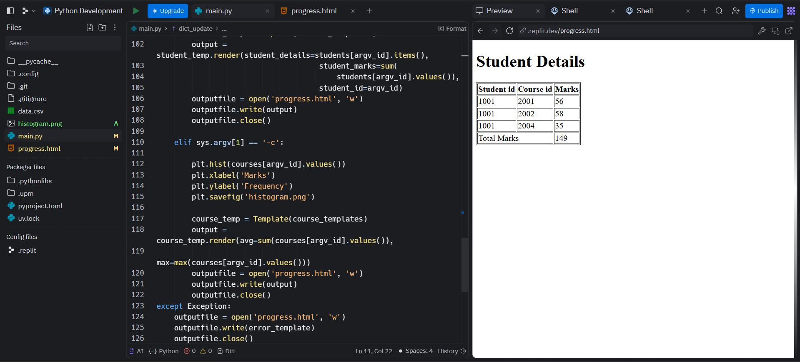
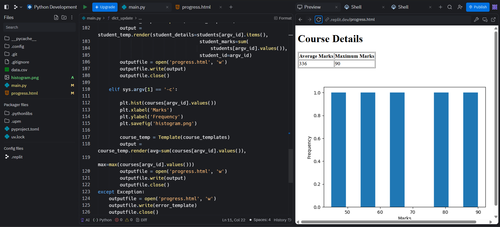

# student-report-generator
# 📊 Student & Course Progress Analyzer 
(Beginner Python Project)

This is my **first Python project**, built to practice core Python concepts like **dictionaries, file handling, command-line arguments, templating, and basic data visualization**. 🎉

The project reads student marks from a CSV file and generates a simple **HTML report** showing either:

* **Student-wise performance**, or
* **Course-wise statistics with a histogram**

---

## 📸 Project Overview

### Student-wise Report



### Course-wise Report



---

## 🚀 What This Project Does

### 1️⃣ Student Mode (`-s`)

* Displays all courses taken by a student
* Shows marks scored in each course
* Calculates **total marks**
* Outputs results into an HTML file

### 2️⃣ Course Mode (`-c`)

* Calculates **average marks** for a course
* Finds **maximum marks** scored in that course
* Generates a **histogram** of marks using Matplotlib
* Embeds the histogram into an HTML page

If wrong inputs are given, the program generates an **error HTML page**.

---

## 🧠 Concepts I Learned From This Project

* Reading CSV files using `csv.DictReader`
* Nested dictionaries in Python
* Writing reusable functions
* Using command-line arguments (`sys.argv`)
* HTML templating with **Jinja2**
* Data visualization using **Matplotlib**
* Generating static HTML reports using Python
* Basic error handling with `try-except`

---

## 🗂️ Project Structure

```
.
├── main.py            # Main Python script
├── data.csv           # Input dataset (student, course, marks)
├── progress.html      # Generated HTML output
├── histogram.png      # Generated histogram (course mode)
├── README.md          # Project documentation
```

---

## 📥 Sample `data.csv` Format

```csv
Student id,Course id,Marks
1001,2001,56
1001,2002,58
1001,2004,35
1002,2001,78
```

---

## ▶️ How to Run the Project

### 🔹 Prerequisites

Make sure you have Python installed, then install required libraries:

```bash
pip install matplotlib jinja2
```

---

### 🔹 Student-wise Report

```bash
python app.py -s 1001
```

✔ Generates `progress.html` showing student details and total marks

---

### 🔹 Course-wise Report

```bash
python app.py -c 2001
```

✔ Generates:

* `histogram.png`
* `progress.html` with average & maximum marks

---

## 🧩 Key Function Explained

```python
def dict_update(d, key1, key2, value):
    if key1 not in d:
        d[key1] = {}
    d[key1][key2] = value
```

This function helps create a **nested dictionary**, ensuring:

* One student → multiple courses
* One course → multiple students

---

## ❌ Error Handling

If invalid inputs are provided (wrong flag or ID), the program:

* Does not crash
* Generates an HTML page saying **"Wrong Inputs"**

---

## 🌱 Why This Project Matters

This project helped me:

* Connect Python with real-world outputs (HTML + charts)
* Understand how backend logic can generate frontend content
* Gain confidence in building end-to-end mini projects

As my **first Python project**, this marks the beginning of my journey into software development 🚀

---

## 🙌 Future Improvements (Ideas)

* Add CSS styling to HTML pages
* Add command-line help (`--help`)
* Validate inputs more cleanly
* Convert this into a Flask web app

---

⭐ If you’re a beginner, this project is a great way to practice **Python fundamentals with visible results**!
